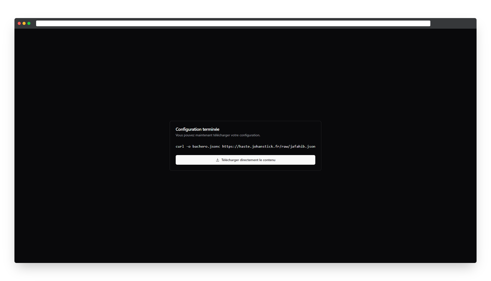

# Bachero Utilities
Un simple site permettant de créé votre config Bachero en quelques clics. Ce site vous posera des questions sur votre configuration et vous proposera le fichier de configuration selon vos réponse.


## Installation
Pour installer le site, vous devez avoir [NodeJS](https://nodejs.org/en/) d'installé sur votre machine. Ensuite, vous pouvez cloner le projet et installer les dépendances avec les commandes suivantes:
```bash 
git clone https://github.com/bacherobot/utilities.git
cd utilities
npm install
```

## Développement
Pour tester vos modifications sur le site, vous pouvez utiliser la commande suivante:
```bash
npm run dev

# ou pour ouvrir le site dans votre navigateur lors du dev
npm run dev -- --open
```

## Technologies utilisées
- [Svelte](https://svelte.dev/)
- [Shadcn/UI for Svelte](https://www.shadcn-svelte.com/)
- [TailwindCSS](https://tailwindcss.com/)
- [Vite](https://vitejs.dev/)
- [TypeScript](https://www.typescriptlang.org/)
- [ESLint](https://eslint.org/)

## Licence
Ce projet est sous licence [MIT](LICENSE).